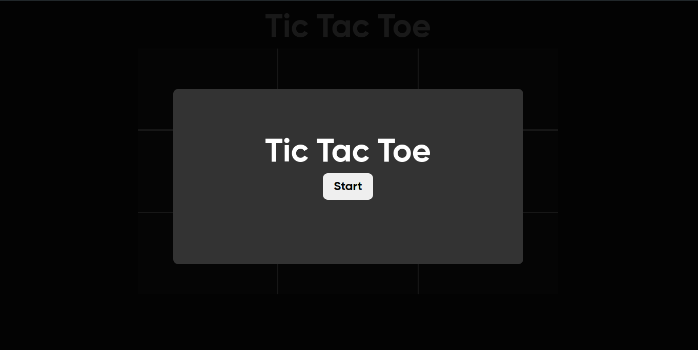
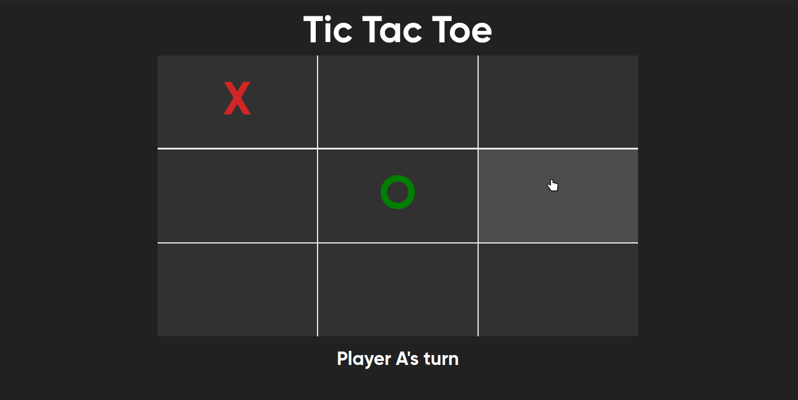
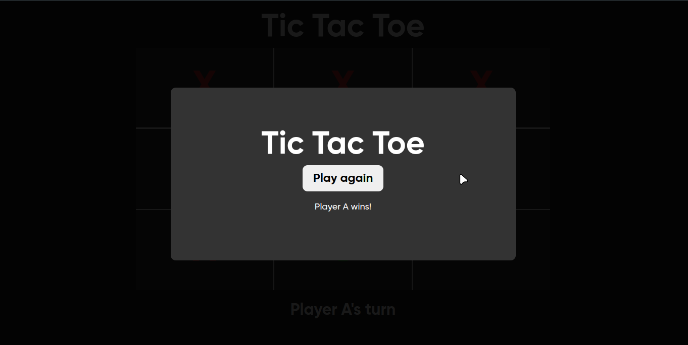

# [Tic Tac Toe Game](https://yashs-2519.github.io/Tic-Tac-Toe/)

This is a simple Tic Tac Toe game implemented using HTML, CSS, and JavaScript. It allows two players to play the game in a browser.

## Table of Contents

- [Features](#features)
- [Installation](#installation)
- [Usage](#usage)
- [Screenshots](#screenshots)
- [Contributing](#contributing)
- [License](#license)

## Features

- Classic Tic Tac Toe game with a 3x3 grid.
- Two-player functionality.
- Displays the winner or indicates a draw.
- Responsive design for different screen sizes.

## Installation

1. Clone the repository:
    ```bash
    git clone https://github.com/YashS-2519/Tic-Tac-Toe.git
    ```

2. Navigate to the project directory:
    ```bash
    cd Tic-Tac-Toe
    ```

3. Open `index.html` in your browser to play the game.

## Usage

1. Open the `index.html` file in a web browser.
2. The game starts with Player A. Click on any empty cell in the grid to make a move.
3. Players take turns clicking on empty cells to place their marks (X or O).
4. The game will display a message indicating the winner or if the game ends in a draw.
5. Click the "Restart" button to reset the game and play again.

## Screenshots





## Contributing

Contributions are welcome! Please follow these steps:

1. Fork the repository.
2. Create a new branch (`git checkout -b feature-branch`).
3. Make your changes.
4. Commit your changes (`git commit -m 'Add some feature'`).
5. Push to the branch (`git push origin feature-branch`).
6. Open a pull request.

## License

This project is licensed under the MIT License - see the [LICENSE](LICENSE) file for details.

